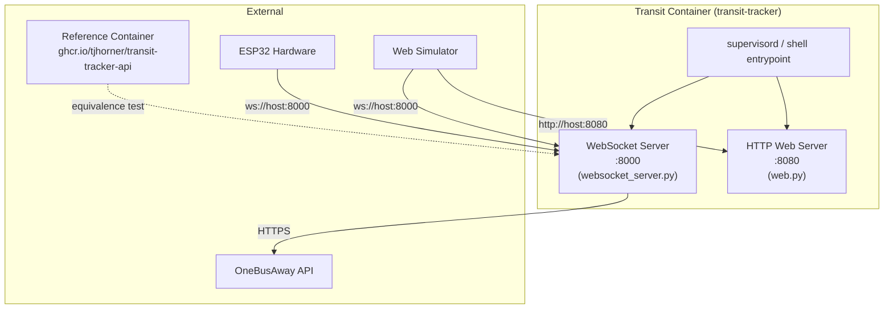

# Design Document: Docker Container Packaging

## Overview

This design packages the Transit Tracker Python web server (HTTP on port 8080) and WebSocket proxy (port 8000) into a single Docker container that is a drop-in replacement for the reference `ghcr.io/tjhorner/transit-tracker-api` image. The container runs both services under a lightweight process supervisor and supports runtime configuration via a mounted YAML file. Lifecycle scripts (`start_container.sh`, `stop_container.sh`) and automated container tests ensure the image builds, starts, and speaks the correct WebSocket protocol.

The key design constraint is API compatibility: existing ESP32 hardware clients and web simulators must connect to this container without modification. The container extends the reference protocol with Washington State Ferries support, route abbreviations, and vessel name mapping — all transparent to clients that don't use those features.

## Architecture



The container uses a multi-stage Docker build:

1. **Build stage** (`python:3.14-slim` + `uv`): installs dependencies into a virtual environment, copies source.
2. **Runtime stage** (`python:3.14-slim`): copies the venv and source from the build stage, runs as a non-root `transit` user.

A shell entrypoint script starts both the WebSocket server and the HTTP web server as background processes, then waits for either to exit. This avoids adding `supervisord` as a dependency — the two processes are simple enough to manage with `exec` and `wait`.

### Port Mapping

| Service | Container Port | Protocol | Notes |
|---------|---------------|----------|-------|
| WebSocket server | 8000 | WS | Reference_Container uses port 3000 for both |
| HTTP web server | 8080 | HTTP | Reference_Container uses port 3000 for both |

### Configuration

- Default: connects to `wss://tt.horner.tj/` (public API)
- Override: mount a config YAML at `/config/config.yaml`
- The entrypoint checks for `/config/config.yaml` and passes it to the service if present

## Components and Interfaces

### 1. Dockerfile

Multi-stage build using `python:3.14-slim` base:

- **Build stage**: installs `uv`, copies `pyproject.toml` and `src/`, runs `uv sync --no-dev` to create a production venv
- **Runtime stage**: copies venv + source from build stage, creates non-root `transit` user (UID 1000), sets `EXPOSE 8000 8080`
- Excludes: tests, scripts, dev dependencies, `.git`, data/gtfs (large GTFS files)

### 2. Entrypoint Script (`docker/entrypoint.sh`)

Shell script that:
1. Determines config path: uses `/config/config.yaml` if mounted, otherwise uses built-in defaults
2. Starts the WebSocket service (`python -m transit_tracker.cli service`) in the background — this runs both the WebSocket proxy server (:8000) and the notification client
3. Starts the HTTP web server (`python -m transit_tracker.cli web`) in the background (:8080)
4. Does NOT start the GUI (`transit-tracker gui`) — the tray icon is macOS-only and not relevant in a container
5. Sets `auto_launch_gui: false` via environment or config override to prevent the service from spawning a GUI subprocess
6. Waits for both processes; exits if either dies

### 3. Start Script (`scripts/start_container.sh`)

```
Usage: scripts/start_container.sh [--detach]
```

- Builds the image if not present locally (`docker build -t transit-tracker .`)
- Runs the container with port mappings (`-p 8000:8000 -p 8080:8080`)
- Mounts local config: `-v $(pwd)/.local/home.yaml:/config/config.yaml:ro` (default profile; override with `--config <path>`)
- With `--detach`: runs in background, waits for WebSocket port 8000 to accept connections (up to 60s)
- Without `--detach`: runs in foreground with `--rm`

### 4. Stop Script (`scripts/stop_container.sh`)

- Stops the `transit-tracker` container via `docker stop`
- Removes the stopped container via `docker rm`
- Exits cleanly with a message if no container is running

### 5. Equivalence Test (`scripts/verify_cloud_equivalence.py` extension)

Extends the existing equivalence verification to support container-vs-container comparison:
- Pulls `ghcr.io/tjhorner/transit-tracker-api` if not present
- Starts both containers with a shared reference config (at least 2 route/stop pairs)
- Connects to each via WebSocket, sends identical `schedule:subscribe` messages
- Compares top-level response keys and per-trip field names
- Produces a human-readable report with trip counts, field matches, and divergences
- 120-second timeout with skip-on-timeout behavior

### 6. Container Tests (`tests/test_container.py`)

Pytest-based tests that:
- Build the Docker image
- Start the container
- Verify WebSocket connection on port 8000 receives a `heartbeat` within 60s
- Verify `/openapi` returns valid JSON
- Clean up containers and images after completion

### 7. Steering File (`.kiro/steering/docker.md`)

Documents:
- Dockerfile location and image naming convention (`transit-tracker:latest`)
- Port mappings (8000 WS, 8080 HTTP)
- Config volume mount path (`/config/config.yaml`)
- Note: Reference_Container runs on port 3000 (single port for both WS and HTTP)
- Start/stop script locations and usage
- Container test file location and how to run tests

## Data Models

### Board Subscription Configuration (mounted YAML)

Config files are subscription configurations for the transit board — they define which stops and routes the board displays. The same config must work when connected to either the reference container or this project's custom container. See `.kiro/steering/board-config.md` for the full reference.

The reference board config for equivalence testing uses only standard Sound Transit stops (no ferries, no abbreviations, no custom features) so it is valid for both containers:

```yaml
transit_tracker:
  base_url: "wss://tt.horner.tj/"
  time_display: arrival
  show_units: short
  list_mode: sequential
  scroll_headsigns: true
  stops:
    - stop_id: "st:1_8494"
      time_offset: "-7min"
      routes:
        - "st:40_100240"
    - stop_id: "st:1_11920"
      time_offset: "-9min"
      routes:
        - "st:1_100039"
```

This is based on `.local/home.yaml`. The two stops (`st:1_8494` on route `st:40_100240`, and `st:1_11920` on route `st:1_100039`) provide the minimum two route/stop pairs required by Requirement 3. Both containers fetch from the same upstream OBA API, so output should be structurally identical.

Available board config profiles:
- `.local/home.yaml` — reference config (Sound Transit only, no extras) — valid for both containers, **used for equivalence testing**
- `.local/adventure.yaml` — extended config (ferries + Sound Transit + abbreviations) — custom container only
- `.local/needle_stops.yaml` — minimal config (two Space Needle area stops) — valid for both containers

### Equivalence Test Report

```json
{
  "transit_container": {
    "trip_count": 3,
    "top_level_keys": ["event", "data"],
    "trip_fields": ["tripId", "routeId", "routeName", "stopId", "stopName", "headsign", "arrivalTime", "departureTime", "isRealtime"]
  },
  "reference_container": {
    "trip_count": 2,
    "top_level_keys": ["event", "data"],
    "trip_fields": ["tripId", "routeId", "routeName", "stopId", "stopName", "headsign", "arrivalTime", "departureTime", "isRealtime"]
  },
  "schema_match": true,
  "field_match": true,
  "divergences": []
}
```

### Docker Image Metadata

- Image name: `transit-tracker`
- Tag: `latest` (default), or git SHA for CI
- Base: `python:3.14-slim`
- User: `transit` (UID 1000)
- Exposed ports: 8000, 8080


## Correctness Properties

*A property is a characteristic or behavior that should hold true across all valid executions of a system — essentially, a formal statement about what the system should do. Properties serve as the bridge between human-readable specifications and machine-verifiable correctness guarantees.*

### Property 1: Schedule response schema completeness

*For any* `schedule` WebSocket response emitted by the Transit_Container, every trip object in `data.trips` must contain exactly the fields: `tripId`, `routeId`, `routeName`, `stopId`, `stopName`, `headsign`, `arrivalTime`, `departureTime`, `isRealtime` — with no missing or extra keys.

**Validates: Requirements 2.2**

### Property 2: Subscribe message acceptance

*For any* valid `schedule:subscribe` message containing an `event` field of `"schedule:subscribe"` and a `data.routeStopPairs` string of semicolon-separated `routeId,stopId[,offset]` entries, the WebSocket server must accept the message without error and begin sending `schedule` events.

**Validates: Requirements 2.1**

### Property 3: Schema equivalence with reference container

*For any* shared configuration with at least one route/stop pair, when both the Transit_Container and Reference_Container receive identical `schedule:subscribe` messages, the top-level response keys and per-trip field names in the resulting `schedule` events must match exactly.

**Validates: Requirements 3.3, 3.4**

### Property 4: ID prefix normalization round-trip

*For any* stop or route ID string using the `st:` or `wsf:` prefix conventions, `normalize_id` must produce a valid OBA-format ID (agency_number pattern), and the original prefix must be preserved in the `stopId` field of outgoing trip objects so clients see the ID they subscribed with.

**Validates: Requirements 8.2**

### Property 5: Arrival/departure mode selection

*For any* trip with OBA `arrivalEnabled` and `departureEnabled` flags, the server must select the arrival time when `arrivalEnabled=True` and `departureEnabled=False`, the departure time when `departureEnabled=True` and `arrivalEnabled=False`, and fall back to the global `time_display` config when both or neither flag is set.

**Validates: Requirements 8.3**

### Property 6: Ferry vessel name mapping

*For any* ferry trip (agency 95) where a `vehicleId` is present in the OBA data, the `headsign` field in the output trip object must be the vessel name from the `WSF_VESSELS` dictionary corresponding to that vehicle ID. When no `vehicleId` is present, the original destination headsign must be preserved.

**Validates: Requirements 8.5**

## Error Handling

| Scenario | Behavior |
|----------|----------|
| OBA API returns 429 (rate limited) | Exponential backoff on refresh interval (doubles, max 600s). Per-stop cooldown. Stale cache served to clients. |
| OBA API unreachable | Retry every `current_refresh_interval` seconds. Serve stale cache if available, GTFS static schedule as fallback. |
| Config file missing at `/config/config.yaml` | Fall back to default config (public API at `wss://tt.horner.tj/`). |
| Config file invalid YAML | Pydantic validation error logged at startup. Container exits with non-zero code. |
| WebSocket client disconnects | Server cleans up subscription state. No effect on other clients. |
| Health check during initialization | No dedicated health endpoint. Docker can check if the container process is running. |
| Reference container unavailable during equivalence test | 120-second timeout, then skip comparison and report timeout. |
| Docker build failure | Start script exits with error. No container started. |
| Port conflict on host | Docker reports bind error. Start script exits with error message. |

## Testing Strategy

### Unit Tests

Unit tests verify specific examples and edge cases using `pytest`:

- **ID normalization**: Verify `normalize_id("wsf:7")` → `"95_7"`, `normalize_id("st:1_8494")` → `"1_8494"`.
- **Default config**: Verify `TransitConfig()` defaults to `wss://tt.horner.tj/`.
- **Dockerfile structure**: Verify the Dockerfile parses, uses multi-stage build, exposes correct ports, runs as non-root.
- **Start/stop scripts**: Verify scripts exist, are executable, and handle edge cases (no container running, `--detach` flag).

### Property-Based Tests

Property-based tests use `hypothesis` (Python) with a minimum of 100 iterations per property. Each test references its design property.

- Generate random trip data, pass through `send_update` formatting, verify output trip objects always contain exactly the 9 required fields.
  - Tag: `Feature: docker-container-packaging, Property 1: Schedule response schema completeness`

- **Property 2 (Subscribe acceptance)**: Generate random valid `routeStopPairs` strings, send to server, verify no error and a schedule event is returned.
  - Tag: `Feature: docker-container-packaging, Property 2: Subscribe message acceptance`

- **Property 3 (Schema equivalence)**: Integration property — requires both containers running. Generate shared configs, compare response schemas. Run as a separate integration test suite.
  - Tag: `Feature: docker-container-packaging, Property 3: Schema equivalence with reference container`

- **Property 4 (ID normalization)**: Generate random prefixed IDs (`st:`, `wsf:`, bare), verify `normalize_id` produces valid OBA format and `stopId` in output preserves the original.
  - Tag: `Feature: docker-container-packaging, Property 4: ID prefix normalization round-trip`

- **Property 5 (Arrival/departure mode)**: Generate random combinations of `arrivalEnabled`/`departureEnabled` flags with arrival and departure timestamps, verify the correct time is selected.
  - Tag: `Feature: docker-container-packaging, Property 5: Arrival/departure mode selection`

- **Property 6 (Ferry vessel mapping)**: Generate random ferry trips with and without `vehicleId`, verify headsign is vessel name when vehicleId is present and original headsign when absent.
  - Tag: `Feature: docker-container-packaging, Property 6: Ferry vessel name mapping`

### Container Integration Tests

Separate from unit/property tests, these require Docker:

- Build the image, start the container, verify WebSocket heartbeat and `/openapi` response.
- Run equivalence test against reference container (optional, requires network).
- All container tests clean up after themselves.

### Test Configuration

- Property-based testing library: `hypothesis`
- Minimum iterations: 100 per property (`@settings(max_examples=100)`)
- Container tests marked with `@pytest.mark.docker` for selective execution
- Equivalence tests marked with `@pytest.mark.integration` and skipped when `TRANSIT_TRACKER_TESTING=1`
