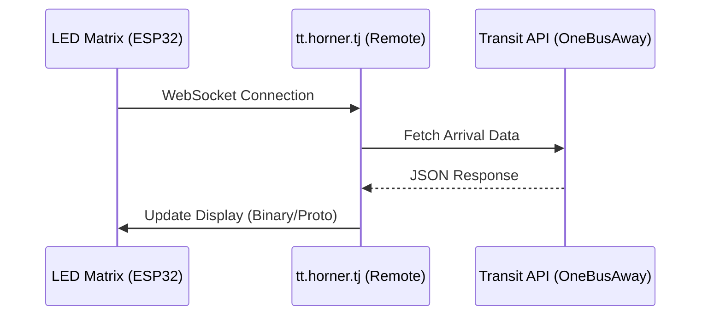
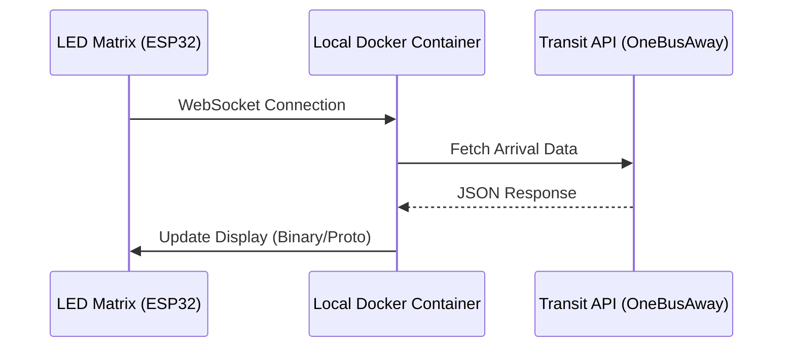
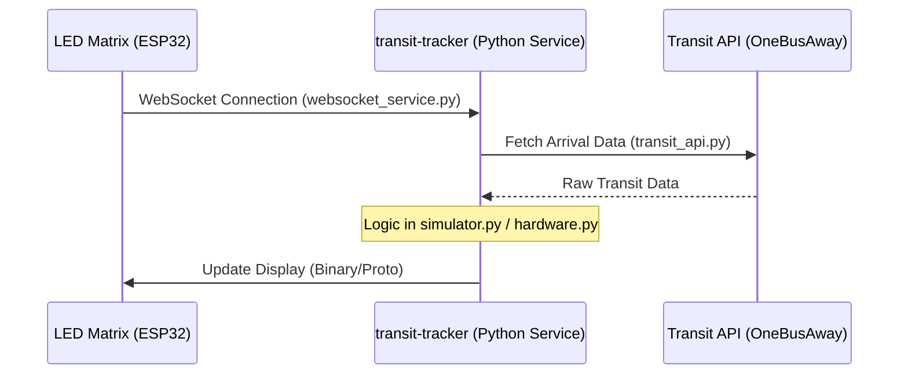

# 🏙️ Transit Tracker

A lightweight, terminal-based transit notification service for macOS. It monitors public transit arrivals using the OneBusAway API and GTFS-Realtime feeds, sending push notifications to your devices via [ntfy.sh](https://ntfy.sh/) when your bus or train is approaching.

## ✨ Features

- **Interactive Configurator:** A beautiful, inline Terminal User Interface built with `rich` and `questionary`.
- **Location-based Routing:** Search for cross-streets (e.g., "Rainier Blvd & Charles St, Issaquah"), automatically reverse-geocode them via OpenStreetMap Nominatim, and find nearby transit routes.
- **Background Daemon:** Runs silently in the background on your Mac using `launchd`.
- **Push Notifications:** Pushes rich alerts to your phone via `ntfy.sh` (e.g., "Bus 554 arriving in 5 mins!").

## 🏗️ Architecture & Evolution

The project is evolving from a cloud-dependent configuration to a fully self-hosted local service.

### 1. Default Configuration (Cloud)
*The hardware connects to a remote service that proxies the transit data.*



### 2. Desired State (Self-Hosted Docker)
*Running the original service logic locally within a container.*



### 3. Future State (Python-Native API)
*Directly serving data from this Python package, removing Docker overhead and enabling tighter integration with local notifications.*



## 📦 Installation

This project is built and managed using `uv`. To install it globally as a self-contained command-line tool, run the following from the project directory:

```bash
uv tool install .
```

This creates an isolated virtual environment and links the `transit-tracker` executable to your system path.

## 🚀 Usage

Once installed, you can run the tool from anywhere in your terminal.

### 1. Launch the TUI (Configurator)

To open the interactive dashboard:

```bash
transit-tracker
# or
transit-tracker ui
```

**Inside the TUI:**
1. Click **Add Stop**.
2. Type in an intersection or address (e.g., `Rainier Blvd & Charles St, Issaquah`).
3. Select a nearby route.
4. Select the specific stop and direction.
5. Click **Save Changes**.

### 2. Start the Background Service

You can start the background monitor directly from the TUI (using the "Start Service" button), which automatically creates and registers a macOS `launchd` plist file so it runs continuously.

Alternatively, you can run the service directly in the foreground for debugging:

```bash
transit-tracker service
```

## ⚙️ Configuration

Configuration is saved in a local `config.yaml` file in your current working directory when saving from the TUI.

```yaml
api_url: wss://tt.horner.tj
ntfy_topic: transit-alerts
arrival_threshold_minutes: 5
check_interval_seconds: 30
subscriptions:
  - feed: st
    route: 1_100236
    stop: 1_80485
    label: 554 - Rainier Blvd S & E Sunset Way
```

## 🛠️ Hardware Components

This project is designed to run on specific LED matrix hardware. Below are the components used in this build:

- **Waveshare RGB Full-Color LED Matrix Panel (64×32 Pixels):** 2.5mm pitch. Ordered on March 2, 2026 (Order # 113-9435943-2623440), and delivered on March 2, 2026.
- **Adafruit ESP32-S3 LED Matrix Portal:** A specialized driver board for HUB75 panels. (Adafruit Order #3641312, shipped March 3, 2026). [Track Delivery](https://tools.usps.com/go/TrackConfirmAction?qtc_tLabels1=9405540106246002702780).
- **Related Hardware:** The system is built around the ESP32-S3 architecture and standard HUB75 64x32 RGB panels.

## 🛠️ Development

If you are developing or modifying the codebase, you can run tests using:

```bash
uv run pytest
```
