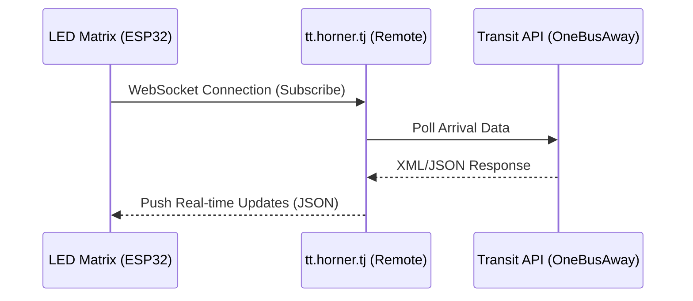
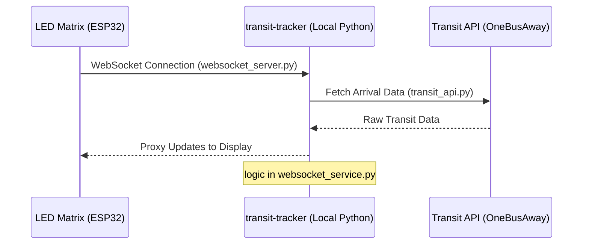
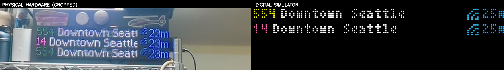

# 🏙️ Transit Tracker

A lightweight, terminal-based transit data proxy for macOS. It monitors public transit arrivals using the OneBusAway API and GTFS-Realtime feeds, providing an exact 1-to-1 WebSocket API compatible with the official Transit Tracker LED matrix hardware.

## ✨ Features

- **Interactive Configurator:** A beautiful, inline Terminal User Interface built with `rich` and `questionary`.
- **Location-based Routing:** Search for cross-streets (e.g., "Rainier Blvd & Charles St, Issaquah"), automatically reverse-geocode them via OpenStreetMap Nominatim, and find nearby transit routes.
- **Background Daemon:** Runs silently in the background on your Mac using `launchd`.
- **Reference Compatibility:** Provides the EXACT WebSocket payload expected by the reference ESP32 firmware.
- **Web LED Simulator:** A browser-based HUB75 LED matrix emulator with live WebSocket data, pixel-perfect MicroFont rendering, and headsign scrolling.
- **Walkshed Map:** Mapbox-powered isochrone map showing 5/10/15-minute walking distances from your stops, with route polylines and architectural styling.

## 🏗️ Architecture

The project supports two primary modes of operation: connecting to a cloud-based proxy or hosting a local WebSocket server that interacts directly with transit APIs.

### 1. Default Configuration (Cloud)
*The hardware connects directly to the public WebSocket API hosted by TJ Horner.*



### 2. Local WebSocket Host
*The hardware connects to this Python service running on your local network, which proxies the data.*



## ⛴️ Washington State Ferries (WSF)

The proxy includes specialized support for Washington State Ferries (Agency 95). You can use the `wsf:` prefix for stop and route IDs (e.g., `wsf:7` for Seattle Terminal) for simplified configuration.

### Official Route Abbreviations
The system automatically maps full route names to official WSDOT abbreviations to optimize space on the LED matrix:

| Route | Abbreviation |
| :--- | :--- |
| Seattle / Bainbridge Island | **SEA-BI** |
| Seattle / Bremerton | **SEA-BR** |
| Edmonds / Kingston | **ED-KING** |
| Mukilteo / Clinton | **MUK-CL** |
| Fauntleroy / Vashon | **F-V** |
| Fauntleroy / Southworth | **F-S** |
| Anacortes / San Juan Islands | **ANA-SJ** |
| Port Townsend / Coupeville | **PT-KEY** |

### Smart Arrival vs. Departure Time

The proxy automatically shows the right time for each stop using OBA's per-trip `arrivalEnabled` and `departureEnabled` flags:

| Your terminal | What you see | Why |
| :--- | :--- | :--- |
| **Seattle** (origin dock) | Departure time | `departureEnabled: true` — when the ferry leaves |
| **Bainbridge** (destination dock) | Arrival time | `arrivalEnabled: true` — when the ferry docks |

This is fully automatic — no configuration needed. For non-ferry routes (buses, light rail), the global `time_display` setting applies:

```yaml
time_display: arrival   # default — show when vehicle arrives at your stop
time_display: departure # show when vehicle departs your stop
```

### Vessel Names

When a ferry has live tracking data (realtime `vehicleId` from OBA), the headsign is replaced with the vessel name (e.g., "Puyallup", "Sealth"). When no realtime data is available (scheduled trips), the destination name is shown instead. Vessel names are never cached across trips — different runs are served by different vessels.

### Rate Limiting & Backoff

The local proxy includes exponential backoff to handle OBA API rate limits (HTTP 429):

- On a 429 response, the refresh interval doubles (up to a max of 10 minutes).
- Per-stop cooldown timestamps prevent retrying rate-limited stops before their cooldown expires.
- On successful fetches, the interval gradually recovers (20% reduction per cycle) back to the configured `check_interval_seconds`.
- The cache respects the backed-off interval — during backoff, cached data is reused for the full backoff period rather than triggering fresh API calls.

## 📦 Installation

This project is built and managed using `uv`. To install it globally as a self-contained command-line tool, run the following from the project directory:

```bash
uv tool install .
```

This creates an isolated virtual environment and links the `transit-tracker` executable to your system path.

## 🚀 Usage

Once installed, you can run the tool from anywhere in your terminal.

### 1. Launch the TUI (Configurator)

To open the interactive dashboard:

```bash
transit-tracker
# or
transit-tracker ui
```

**Inside the TUI:**
1. Click **Add Stop**.
2. Type in an intersection or address (e.g., `Rainier Blvd & Charles St, Issaquah`).
3. Select a nearby route.
4. Select the specific stop and direction.
5. Click **Save Changes**.

### 2. Start the Background Service

You can start the background monitor directly from the TUI (using the "Start Service" button), which automatically creates and registers a macOS `launchd` plist file so it runs continuously.

Alternatively, you can run the service directly in the foreground for debugging:

```bash
transit-tracker service
```

## ⚙️ Configuration

Configuration is saved in a local `config.yaml` file in your current working directory when saving from the TUI.

```yaml
api_url: wss://tt.horner.tj
arrival_threshold_minutes: 5
check_interval_seconds: 30
subscriptions:
  - feed: st
    route: 1_100236
    stop: 1_80485
    label: 554 - Rainier Blvd S & E Sunset Way
```

## 🛠️ Hardware Components

This project is designed to run on specific LED matrix hardware. Below are the components used in this build:

- **Waveshare RGB Full-Color LED Matrix Panel (64×32 Pixels):** 2.5mm pitch.
- **Adafruit ESP32-S3 LED Matrix Portal:** A specialized driver board for HUB75 panels.
- **Related Hardware:** The system is built around the ESP32-S3 architecture and standard HUB75 64x32 RGB panels.

### Initial Firmware (Unboxing) & Upgrades

If you are unboxing a brand new ESP32 board, it must be flashed with the base transit-tracker ESPHome firmware. 
- **From this TUI:** When you click "Flash Device", the application will automatically detect if your board lacks the base firmware. If so, it will prompt you and securely download the latest official `firmware.factory.bin` directly from the [EastsideUrbanism/transit-tracker releases page](https://github.com/EastsideUrbanism/transit-tracker/releases) and flash it over USB.

### Upstream Sources

To stay up to date with the core project:
- **Firmware Binary Updates:** Releases are published to [EastsideUrbanism/transit-tracker/releases](https://github.com/EastsideUrbanism/transit-tracker/releases). You can apply OTA updates via the web configurator or ESPHome dashboard.
- **Data APIs:** The transit data proxy is hosted at `wss://tt.horner.tj`. The underlying API project container is maintained at [tjhorner/transit-tracker-api](https://github.com/tjhorner/transit-tracker-api). You can self-host the API using the official Docker image (`ghcr.io/tjhorner/transit-tracker-api:latest`).

## 📸 Hardware Capture & Auto-Crop

The project includes a specialized utility for validating your physical LED board against the simulator. Because LED matrices use PWM (multiplexing), they often appear jittery or have black bands in single photos. 



This tool uses **Temporal Frame Averaging** to merge multiple frames from a video/timelapse into a single smooth image, then uses **Color-Selective Template Matching** to automatically identify and crop the transit board from the photo using the simulator as a "fingerprint".

### 1. Capture & Average
If you have a DJI Action 4 or similar camera connected, you can use the background watcher to automatically process new timelapse footage:

```bash
uv run python scripts/watch_and_average.py
```

### 2. Auto-Crop the Board
To reliably isolate the transit board from a photo (even if it's handheld or has background clutter):

```bash
uv run transit-tracker-capture [path_to_image.jpg]
```

**How it works:**
- It generates a high-fidelity "template" from the live simulator.
- It masks for the specific **Hot Pink (Route 14)** and **Neon Yellow** LED colors.
- It performs a multi-scale search to find that exact pixel pattern in your photo.
- It saves the result to `captures/capture_YYYYMMDD_HHMMSS.jpg`.

## 🗺️ Route Map

The project includes a script to generate an interactive route map from the GTFS static schedule data, covering all three agencies (King County Metro, Sound Transit, Washington State Ferries).

```bash
uv run python scripts/download_gtfs.py   # download & index GTFS data first
uv run python scripts/build_route_map.py # generate the map
open data/route_map.html
```

The output is a self-contained HTML file that renders 188 routes as color-coded polylines using [Leaflet.js](https://leafletjs.com/) — loaded from CDN at runtime, with no Python mapping library required. Each route is hoverable with its name and agency. The generated file is gitignored since it's a build artifact derived from the GTFS data.

## 🛠️ Development

If you are developing or modifying the codebase, you can run the full test suite using:

```bash
./scripts/ci_local.sh
```

### Live Cloud Equivalence Check
To verify that your local proxy is producing data identical to the official cloud endpoint, run:

```bash
uv run python scripts/verify_cloud_equivalence.py
```

This performs a live structural and data-parity check against `wss://tt.horner.tj/`.
